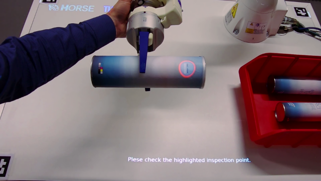

# tum_ar

## Introduction

The `tum_ar` package provides a collection of tools for human-machine interfaces for manual and collaborative tasks in
industrial manufacturing environments. It is meant for collaborative workspace equipped with a top-down projector.


It can be used to project instructions on static objects, as shown above, but also works with dynamic objects held by
a robot's end effector. 



### System components

The package consists of three major nodes:


The `ar_server` manages ar tasks. It receives new tasks as an `tum_ar_msgs/ARTaskAction` on the `ar_task` topic. It then
feeds the `ar_window` with the individual projection slides and waits for a user feedback.
The feedback can also be supplied by other sources, such as the `touchscreen_window` node.

Note that all nodes are launched within the `/ar` namespace by default.

## Setup

The system requires configuration parameters describing the projector, e.g.

```
projector_frame: "epson_optical_frame"
projection_matrix:
  - [2700,    0, 960]
  - [   0, 2700, 600]
  - [   0,    0,   1]
resolution: [1920, 1200]
```

A sample config file can be found in `tum_ar_window/config/projector_tum.yaml`.
The projection matrix is equivalent to k matrix describing a camera using the pinhole model.

Once you created a new config file for your projector open the launch file at `tum_ar_window/launch/ar_window.launch`
and change the line 
```
<arg name="projector_config" default="$(find tum_ar_window)/config/projector_tum.yaml"/>
```
to include your yaml file instead, or provide a parameter accordingly.

## Usage

### Launch Projection

To start projecting you need to launch the `ar_server` and `ar_window` by executing
```
roslaunch tum_ar_window ar.launch
``` 

Note that the AR window will launch in full screen mode. You can use the <ALT> + <Tab> keyboard shortcut to get back to
your desktop. By right clicking on the windows entry in your task bar you can move it to another screen if required.
You can now use the `ar_task` interface to show a set of instructions.

### Defining AR Slides

All projections setups are speciqied as AR slides defined by the `tum_ar_msgs/ARSlide` message type. Each slide is
composed of the following four types of definitions:

* `pois` - A Point of Interest (POI) is a point to be highlighted be drawing a circle around it. It is defined by
   * `header` - Header specifying the frame in which the POI is defined 
   * `position` - `<x, y, z>` position of the POI
   * `border_color` - Color of the circle drawn around the POI
   * `fill_color` - Fill color of the circle
   * `radius` - Radius of the highlighted area in meters
   * `label` - Optional label to be projected next to the POI
* `boxes` - Similar to POIs it is possible to define rectangular areas to be highlighted:
   * `header` - Header specifying the frame in which the box is defined
   * `position` - `<x, y, z>` position of the box
   * `border_color` - Color of the box's frame
   * `fill_color` - Fill color of the box
   * `width` - Width of the box
   * `height` - Height of the box
   * `label` - Optional label to be projected next to the box
* `instruction` - Instruction to be projected on close to the bottom of the projection area (see sample images in
   introduction)
* `outcomes` - An array Define the possible outcomes of a task. Each slide has to be completed by an input selecting one
  of the possible outcomes)
  * `id` - ID of the outcome state
  * `name` - Name of the outcome state
  * `type` - Type of the outcome state (`TYPE_DEFAULT`, `TYPE_INFO`, `TYPE_SUCCESS`, `TYPE_WARN` or `TYPE_ERROR`).
     This defines how the potential outcome is styled in the UI.

As the definition of slides can be time-consuming, it is also possible to define them in a file and just pass the path
as a parameter. A sample file can be found at `tum_ar_window/slides/example.yaml`.

### Touchsreen Interface


The `tum_touchscreen_ui` package provides an additional interface, allowing the user to make inputs in a simple way.
Similar to the `ar_window` node it receive the individual AR slides provided by the `ar_server`. However, it only
displays the instruction as well as one button for each possible outcome.